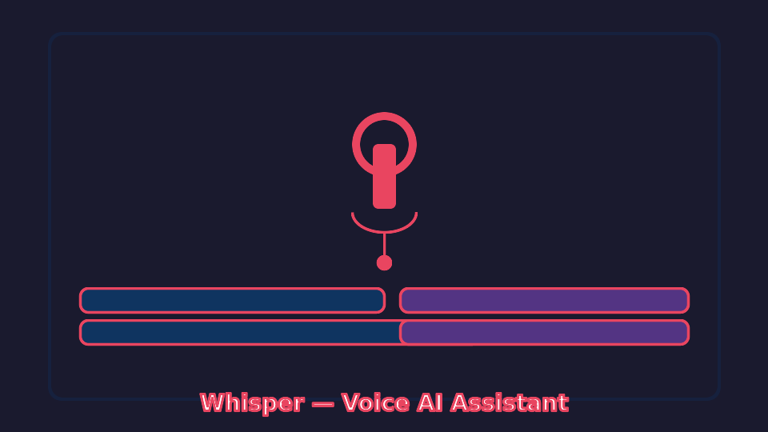

# Whisper

Live voice-activated AI assistant for [Noctalia Shell](https://noctalia.dev). Talk; it listens, detects when you stop, transcribes, and answers — no buttons, no submit. Built for interviews, meetings, and always-on voice workflows.



## Features

- **Live mode (default)** — Continuous listening. When you pause, the assistant answers automatically.
- **Push-to-talk fallback** — Manual one-shot recording when you want explicit control.
- **Speech-to-Text** — Groq Whisper API (free tier).
- **Streaming LLM** — Groq (default, free), Anthropic Claude, or Google Gemini.
- **Persistent chat** — Markdown-rendered history, kept across sessions.
- **Keyboard-shortcut driven** — Bind one key; no UI fiddling during use.
- **Text input** — Type at any time, even while Live is listening.

## Requirements

- Noctalia Shell 4.1.2+
- PipeWire (with the `pipewire-pulse` compatibility layer, which is standard)
- `ffmpeg` on `$PATH` — used for the live audio pipeline
- A Groq API key ([free at console.groq.com](https://console.groq.com/keys))

Optional: `pw-record` for the legacy push-to-talk mode (usually comes with PipeWire).

## Setup

1. Install the plugin through Noctalia's plugin manager or manually.
2. Go to **Settings > Plugins > Whisper** and enter your Groq API key.
3. Add the bar widget in **Settings > Bar**.
4. Bind a keyboard shortcut in your compositor:

```bash
qs -c noctalia-shell ipc call plugin:whisper toggle
```

Press the shortcut → panel opens, Live mode starts. Talk → pause ~1 s → answer streams in. Press again to stop.

### Compositor examples

**Niri:**
```kdl
binds {
    Mod+Shift+W { spawn "sh" "-c" "qs -c noctalia-shell ipc call plugin:whisper toggle"; }
}
```

**Hyprland:**
```ini
bind = SUPER SHIFT, W, exec, qs -c noctalia-shell ipc call plugin:whisper toggle
```

**Sway:**
```
bindsym $mod+Shift+w exec qs -c noctalia-shell ipc call plugin:whisper toggle
```

## Tuning Live mode

Live mode uses **Voice Activity Detection** (silence threshold + pause duration) to decide when you've finished speaking. If it feels wrong, four sliders in **Settings > Plugins > Whisper > Live Mode** control it:

| Setting | Default | What it does | When to change |
| --- | --- | --- | --- |
| Silence threshold | -15 dB | Audio quieter than this counts as silence. | Assistant never answers: push toward 0 dB (e.g. -12). Cuts you off mid-sentence: push toward -30 dB. Sweet spot is mic-dependent. |
| Pause duration | 0.7 s | How long to stay silent before the assistant answers. | Too eager: raise to 1.0–1.5 s. Too slow: lower to 0.5 s (not below — Whisper rejects chunks under ~0.3 s). |
| Min speech length | 0.7 s | Ignore speech bursts shorter than this. | Filters coughs, clicks, short "uhh". Rarely needs changing. |
| Max speech length | 12 s | Safety net: force a chunk break after this many seconds of continuous speech. | If you regularly talk in one long stream: raise to 20–30 s. If Whisper produces garbled long transcripts: lower to 8 s. |

Diagnostics are in the shell log — look for `VAD: silence_end @ N.NNs`, `VAD: silence_start @ N.NNs`, `Queued chunk …`, and `VAD: force break at …s`.

**If the assistant never answers** and you only see `VAD: force break` (never real silence events): your pause ambient noise is above the threshold. Raise Silence threshold toward 0 dB.

**If it cuts you mid-sentence**: lower Silence threshold (more negative) or raise Pause duration.

**If transcripts are garbled / repeating**: Whisper is hallucinating on a long chunk. Lower Max speech length.

**If it answers with just `.` or `you`**: the hallucination filter missed a phantom. Send the exact transcript — we'll add it to the filter list.

## AI Providers

| Provider | Free Tier | Use Case |
| --- | --- | --- |
| **Groq** (default) | Yes | Handles both STT and LLM with one key. Fastest first-token. |
| **Anthropic Claude** | No | Higher-quality answers when quality beats latency. |
| **Google Gemini** | Yes | Alternative free option. |

## IPC commands

```bash
# Primary: open panel + toggle Live (or PTT if Live is disabled in Settings)
qs -c noctalia-shell ipc call plugin:whisper toggle

# Panel controls
qs -c noctalia-shell ipc call plugin:whisper open
qs -c noctalia-shell ipc call plugin:whisper close

# Explicit Live toggle (independent of the `liveMode` setting)
qs -c noctalia-shell ipc call plugin:whisper live

# One-shot push-to-talk
qs -c noctalia-shell ipc call plugin:whisper record
qs -c noctalia-shell ipc call plugin:whisper stop

# Send a typed message
qs -c noctalia-shell ipc call plugin:whisper send "What is Wayland?"

# Clear chat history
qs -c noctalia-shell ipc call plugin:whisper clear
```

## Environment variables

API keys can also be set via env vars (takes priority over Settings):

```bash
export WHISPER_GROQ_API_KEY="gsk_..."
export WHISPER_ANTHROPIC_API_KEY="sk-ant-..."
export WHISPER_GOOGLE_API_KEY="AI..."
```

## Troubleshooting

| Symptom | Likely cause | Fix |
| --- | --- | --- |
| Panel shows `!!panel.title!!` literals | i18n load failure in Noctalia | Check `i18n/en.json` is present in the installed plugin dir; the plugin has a fallback helper so most strings still read normally. |
| Live starts but nothing happens when I pause | Silence threshold too low for your mic | Raise toward 0 dB in Settings. Check logs for `VAD: silence_end/start` events (real pauses) vs `VAD: force break` (only the safety net firing). |
| Every chunk is a `VAD: force break` | Ambient noise stays above silence threshold during pauses | Raise Silence threshold toward 0 dB (e.g. -12). |
| Assistant answers with just `.` or `you` | Whisper hallucinated on a near-silent chunk; filter missed it | Raise Min speech length. Report the exact transcript. |
| Transcripts are nonsense / repeated sentences | Chunk too long; Whisper hallucinated | Lower Max speech length. Find the knob in Settings. |
| `Audio file is too short` in logs | Should be fixed post-1.1 — tell us if it resurfaces. | Raise Min speech length as a workaround. |
| Mic stays hot after closing panel | Stale process from an earlier crash | `pkill -f whisper-live` once; shouldn't happen in normal operation. |

## Architecture

For the design of the live pipeline, state machine, and IPC contract, see [ARCHITECTURE.md](ARCHITECTURE.md).

## License

MIT
